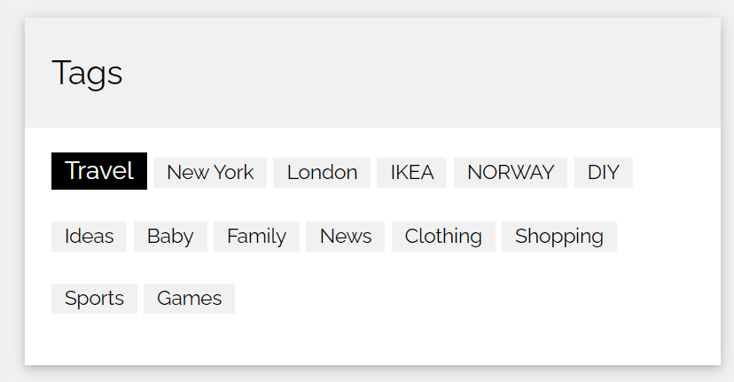

# Practica

## SinglePost

1. Sugeneruoti tagus paprastai elemente
2. sukurti PostTags componenta jis gauna props tagu masyva ir sugeneruoja tagus.
3. tagu masyvas atrodytu sitaip 

## PostList

1. atvaizduoti kiek turim elementu.
2. suskaiciuoti kiek is viso yra reactions ir atvaizduoti.

## UsersList

1. Sukurti komponenta
2. Parsiunciate duomenis is (https://dummyjson.com/users)
3. sugeneruojam korteles useriams.
   
   korteleje atvaizduoti su graziu css:

- firstName
- lastName
- age
- email
- image
- eyeColor

4. prisideti mygtuka individualiam useriui "delete" ir jo pagalba istrinti useri is saraso
5. prideti bendra mygtuka sort, kuri isrikiuoja userius pagal amziu
